<h3 align="center"> 
	🚧 Feedback Widget 🚀
</h3> 

<h1 align="center">
    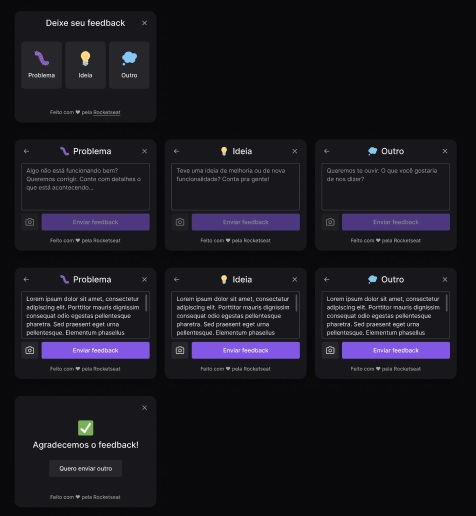
</h1>

Desafios da trilha Impulse 💜 da NLW 8 Return da Rocketseat.

### ✅ Estado atual (v2)

- Widget em português, acessível (axe 0 violações), com mensagens de erro e captura só da área visível.
- API Express 5 + TypeScript: validação com zod, escape do HTML do e-mail, CORS por lista, limite de 5 envios/min e de 4 MB por captura.
- Credenciais SMTP e banco via `.env` (veja `server/.env.example`); sem SMTP a API registra no console, sem banco usa memória.
- 13 testes (10 Jest na API + 3 Vitest no widget).

```sh
cd server && cp .env.example .env && npm install && npx prisma generate && npm run dev   # :3333
cd web && cp .env.example .env && npm install && npm run dev                           # :5173
```

### 🌐 Em produção

- Widget: https://feedback-widget-web.onrender.com · API: https://feedback-widget-api.onrender.com/health
- Hospedagem gratuita: Render (API + site estático no mesmo `render.yaml`) com PostgreSQL no Neon, publicada a cada push na `main`.
- Passo a passo completo (Mailtrap, Neon, Render, CI e conferência): [docs/DEPLOY.md](docs/DEPLOY.md).

Documentação: [docs/ANALISE.md](docs/ANALISE.md) · [docs/ARQUITETURA.md](docs/ARQUITETURA.md) · [docs/PLANO-DE-ACAO.md](docs/PLANO-DE-ACAO.md) · [docs/DEPLOY.md](docs/DEPLOY.md)

### 💻 Sobre o projeto

---

- Inspiração do projeto desenvolvido no Bootcamp NLW-8 Return na trilha Impulse da Rocketseat.
<p align="center" style="display: flex; align-items: flex-start; justify-content: center;">
  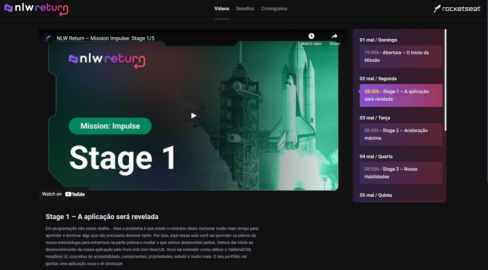
  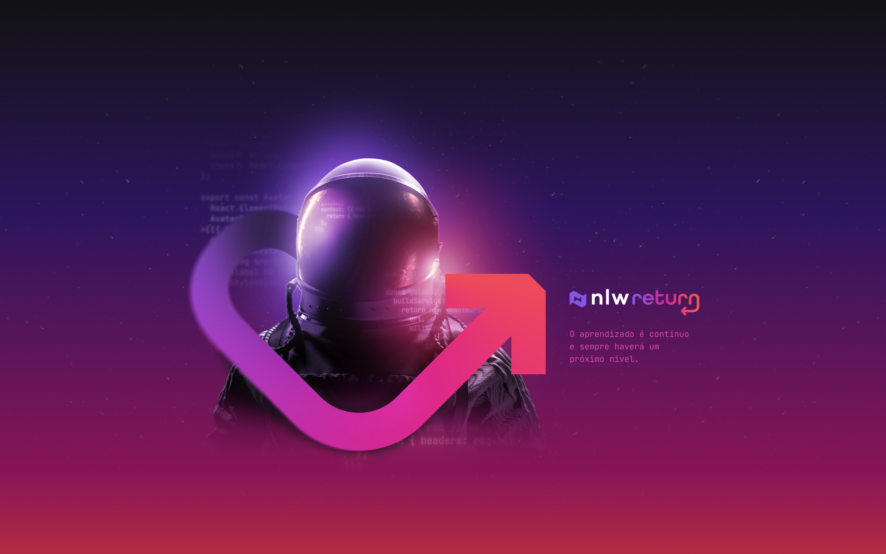
  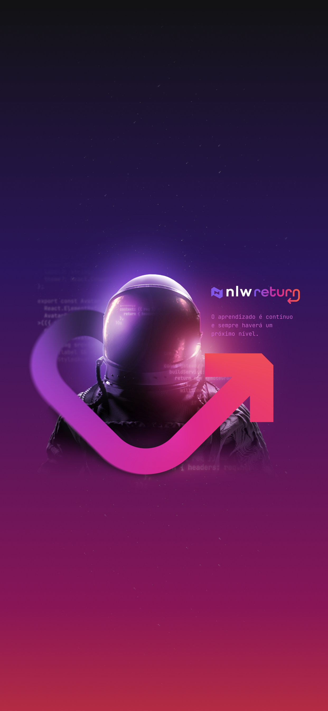
</p>
- Desenvolver um widget para capturar feedback.
<p align="center" style="display: flex; align-items: flex-start; justify-content: center;">
  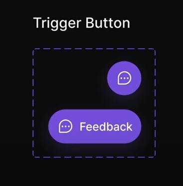
</p>
- Utilizar o template do layout a seguir para construir.
<p align="center" style="display: flex; align-items: flex-start; justify-content: center;">
  
</p>
- Seguir o paradigma mobile first para desenvolver o layout.

### 🚀 Layout

---

- Consultar e atender o layout do projeto no [Figma](https://www.figma.com/community/file/1102912516166573468). Utilizar os assets exportando do figma. 
- Mais detalhes estão no [Notion](https://efficient-sloth-d85.notion.site/NLW-Return-4e1cf60ece8f42d08254810f7bb14401)

### 🚀 Techs

---

- html, css, javascript
- reactjs
- typescript
- tailwind
- acessibilidade com headless

### 🚀 Ferramentas

---

- A seguir temos as ferramentas que compõem essa aplicação. O mailtrap responsável por enviar por e-mail as informações do feedback. Na versão original, o vercel hospedava o front e o railway, o banco de dados e o backend; hoje tudo roda no Render com o banco no Neon (veja [docs/DEPLOY.md](docs/DEPLOY.md)).
<p align="center" style="display: flex; align-items: flex-start; justify-content: center;">
  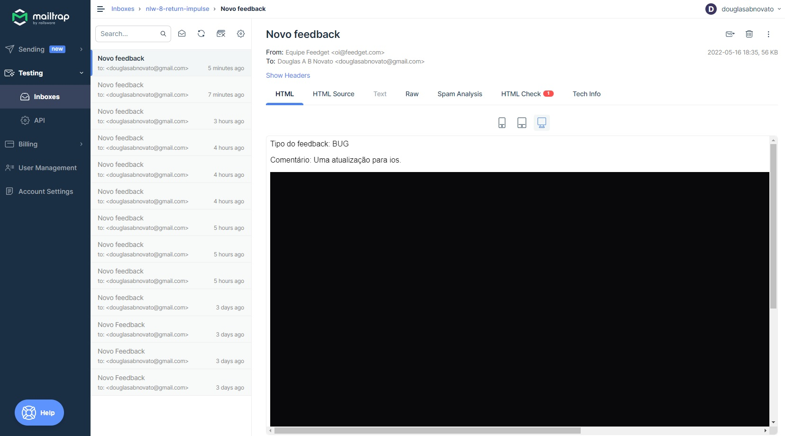
  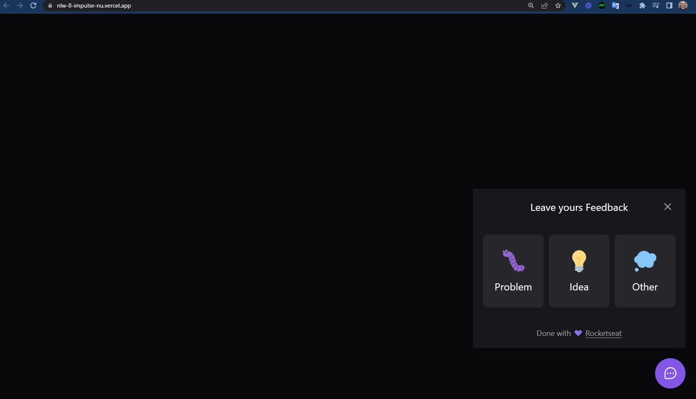
  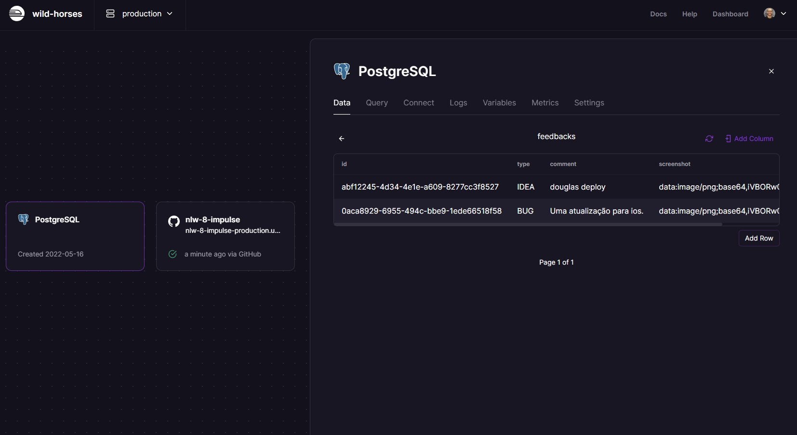
  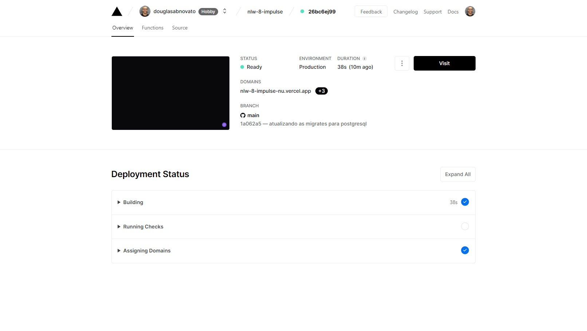
</p>

### 🛠 Construindo
 
---

#### back
- setup da aplicação
- rota
- prisma para banco de dados
- estrutura do banco de dados: tabela feedback
- enviar email com a mailtrap
- teste unitário com  jest

#### front
- Componentização
- Propriedades
- Comunicação entre os componentes no reactjs
- pixel perfect
- navegação pelo teclado
- ux

### 😯 Finalizado 

---

- Construindo a aplicação em versões.
- versão 2
<p align="center" style="display: flex; align-items: flex-start; justify-content: center;">
  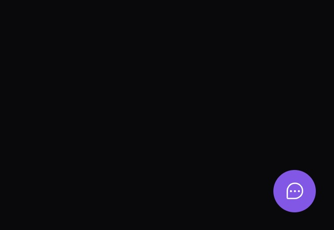
  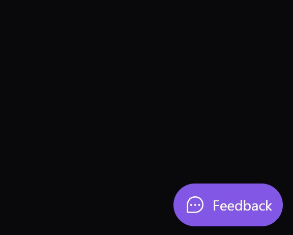
  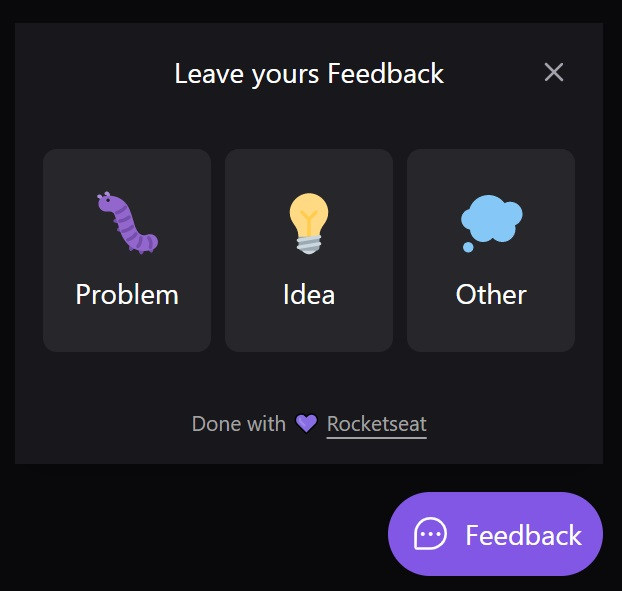
  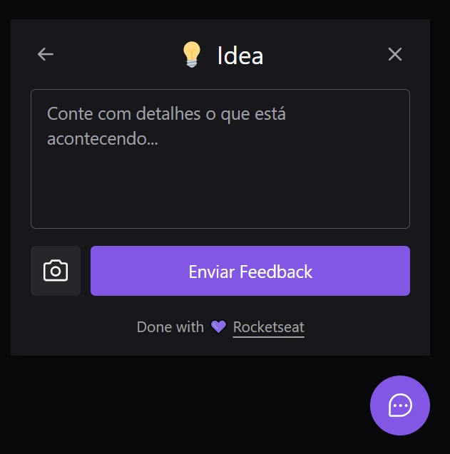
</p>
- versão 0, versão 1
<p align="center" style="display: flex; align-items: flex-start; justify-content: center;">
  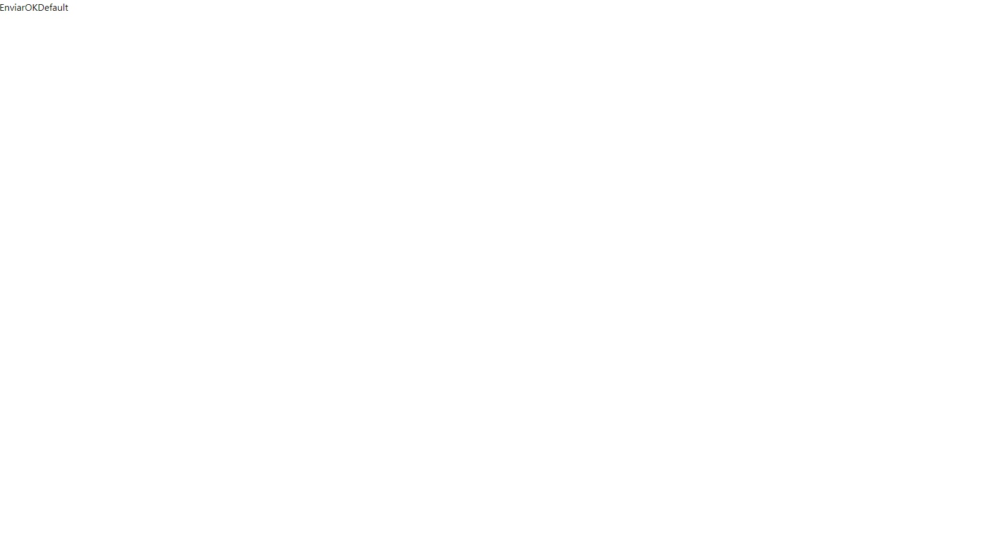
  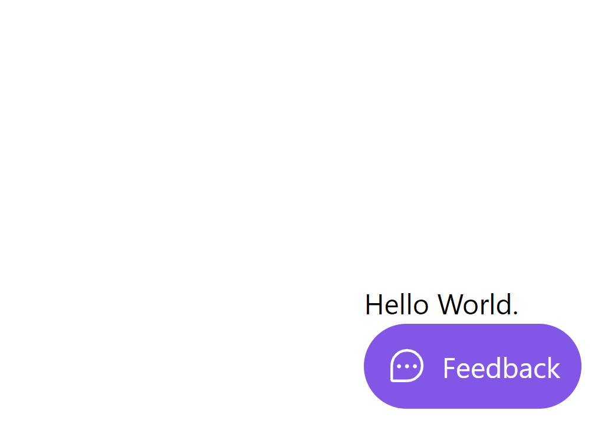
</p>

### 🧭 Adicionado

---

- texto da aplicação em inglês

### 💻 Próximo passo

- fazer o translate da aplicação: português inglês
- responsividade de forma fluída
- tema dark e light
- melhorar o html do e-mail
- dashboard dos feedbacks com autenticação usando firebase/oAuth
- validação de campos e erros

---  

Feito com ❤️ por Douglas A B Novato 👋🏽 [Entre em contato!](https://www.linkedin.com/in/douglasabnovato/)
