<h3 align="center"> 
	🚧 Feedback Widget 🚀
</h3> 

<h1 align="center">
    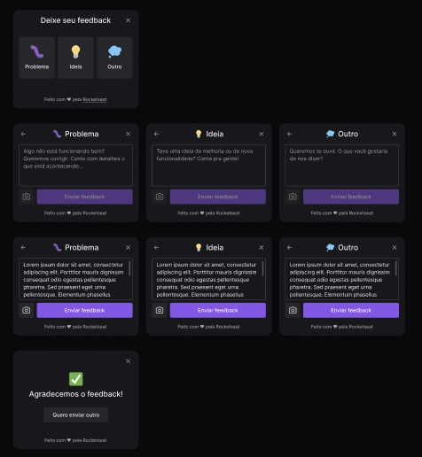
</h1>

Desafios da trilha Impulse 💜 da NLW 8 Return da Rocketseat.

## Estado e próximos passos (ciclo de 16/11/2026)

**No ar:** https://nlw-8-impulse-nu.vercel.app/ respondeu 200 em 16/11/2026, mas é um build de 2022, de outro projeto da Vercel. O projeto novo (`feedback-widget-lfke`) falha em todo deploy antes do build, por configuração (#11). A API não está publicada (`/health` deu 404 em 16/11/2026, #3), então o envio pela demo falha. Critérios do MVP: 8 de 12 atendidos; os 4 parciais dependem de conta ou painel.

**O que foi feito neste ciclo** (PR #30)
- Teste de ponta a ponta da demo com a API real (job `e2e` no CI): envio com captura de tela, POST pelo navegador e axe na página, no diálogo e na confirmação.
- O axe achou contraste baixo no hover de "Enviar feedback" (3,5:1); agora é 6:1.
- Contador de caracteres do comentário (limite de 1000, o mesmo da API), anunciado ao leitor de tela depois de uma pausa.
- Falha da captura de tela vira aviso, e o envio segue sem ela.
- Dependências de produção em dia no patch e no minor (express, nodemailer, axios); `npm audit --omit=dev` com 0 vulnerabilidades.
- Critério 9 revisto: fica "Parcial" enquanto os alertas do Dependabot estiverem desligados (#26).
- Diagnóstico da Vercel e passo a passo em [`docs/DEPLOY.md`](docs/DEPLOY.md).
- Ciclos anteriores: diálogo acessível e teclado (PR #22), medição sem cookie e `main` protegida (PR #23 e #24).

**O que queremos fazer**
- #3 Publicar a API e a demo no Render, com banco no Neon (responsável; Blueprint pronto).
- #11 Corrigir o deploy da Vercel (responsável; passo a passo na issue).
- #15 Criar a conta do GoatCounter (responsável).
- #26 Ligar os alertas do Dependabot (responsável).
- #27 Exigir o job `e2e` na proteção da `main` (responsável).
- #13 Medir LCP e acessibilidade da demo publicada, depois da #11.
- #25 Validar com uma pessoa de fora.
- #28 Atualizar as dependências de versão maior.
- #29 Testar captura e contador no script único.

**Onde está a documentação**
- Estado dos critérios: [`docs/MVP.md`](docs/MVP.md)
- Plano do ciclo: [`docs/PLANO-DE-ACAO.md`](docs/PLANO-DE-ACAO.md)
- Publicação: [`docs/DEPLOY.md`](docs/DEPLOY.md)

### ✅ Estado atual (v2)

- Widget em português, acessível (axe sem violações no teste `e2e`), com mensagens de erro, contador de caracteres e captura só da área visível.
- API Express 5 + TypeScript: validação com zod, escape do HTML do e-mail, CORS por lista, limite de 5 envios/min e de 4 MB por captura.
- Credenciais SMTP e banco via `.env` (veja `server/.env.example`); sem SMTP a API registra no console, sem banco usa memória.
- 42 testes (10 Jest na API, 19 Vitest no web, 10 Playwright do script único e 3 Playwright do fluxo da demo com a API real).

```sh
cd server && cp .env.example .env && npm install && npx prisma generate && npm run dev   # :3333
cd web && cp .env.example .env && npm install && npm run dev                           # :5173
```

Testes: `cd server && npm test`; `cd web && npm test`; `npm run build:widget && npm run test:widget` (script único); `npm run test:e2e` (sobe a API e a demo sozinho, nas portas 3391 e 4391). Os dois últimos pedem `npx playwright install chromium` uma vez; o `test:e2e` também pede `npm ci && npx prisma generate` em `server`, porque sobe a API com `tsx`.

### 🧩 Instalar o widget em outro site

`cd web && npm run build:widget` gera um único arquivo, `web/dist-widget/feedget.js`. Hospede esse arquivo e adicione ao site:

```html
<script src="https://seu-dominio/feedget.js" data-api-url="https://sua-api"></script>
```

O widget roda em um Shadow DOM, sem alterar os estilos da página. O domínio do site precisa estar na lista de CORS da API.

### 🌐 Em produção

- Site: https://nlw-8-impulse-nu.vercel.app/ (build de 2022; o deploy da Vercel falha desde 28/09, #11)
- API e widget no Render: ainda não publicados; o `render.yaml` está pronto.
- Hospedagem gratuita: Render (API + site estático no mesmo `render.yaml`) com PostgreSQL no Neon, publicada a cada push na `main`.
- Passo a passo completo (Mailtrap, Neon, Render, CI e conferência): [docs/DEPLOY.md](docs/DEPLOY.md).

Documentação: [docs/ANALISE.md](docs/ANALISE.md) · [docs/ARQUITETURA.md](docs/ARQUITETURA.md) · [docs/PLANO-DE-ACAO.md](docs/PLANO-DE-ACAO.md) · [docs/DEPLOY.md](docs/DEPLOY.md)

### 💻 Sobre o projeto

---

- Inspiração do projeto desenvolvido no Bootcamp NLW-8 Return na trilha Impulse da Rocketseat.
<p align="center" style="display: flex; align-items: flex-start; justify-content: center;">
  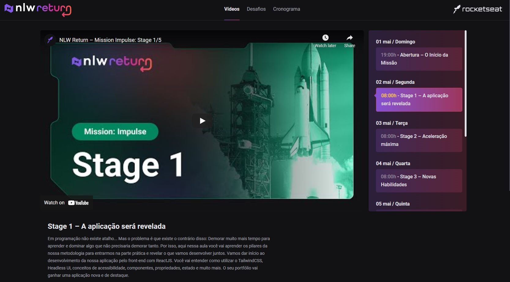
  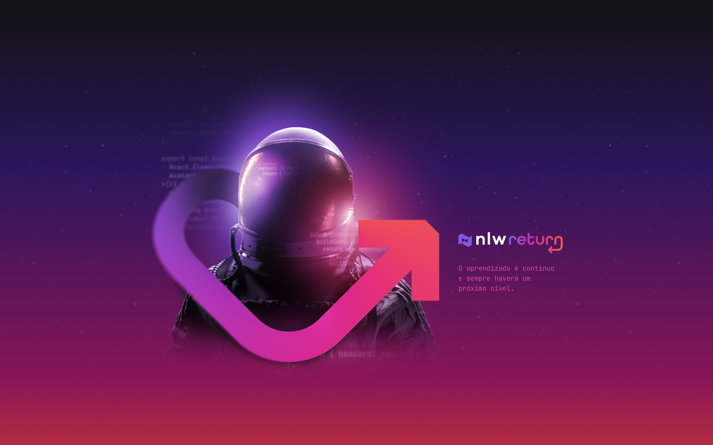
  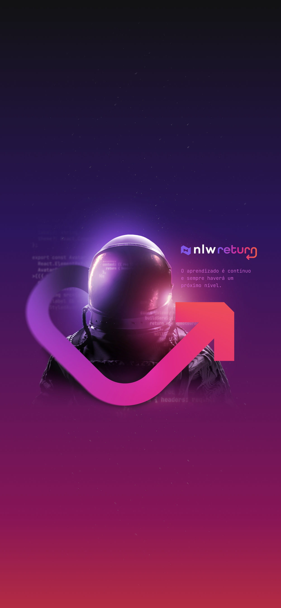
</p>
- Desenvolver um widget para capturar feedback.
<p align="center" style="display: flex; align-items: flex-start; justify-content: center;">
  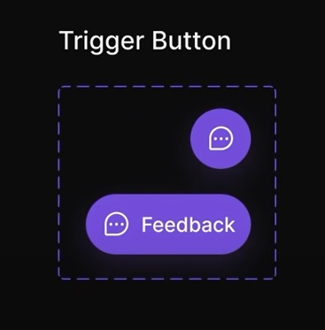
</p>
- Utilizar o template do layout a seguir para construir.
<p align="center" style="display: flex; align-items: flex-start; justify-content: center;">
  
</p>
- Seguir o paradigma mobile first para desenvolver o layout.

### 🚀 Layout

---

- Consultar e atender o layout do projeto no [Figma](https://www.figma.com/community/file/1102912516166573468). Utilizar os assets exportando do figma. 
- Mais detalhes estão no [Notion](https://efficient-sloth-d85.notion.site/NLW-Return-4e1cf60ece8f42d08254810f7bb14401)

### 🚀 Techs

---

- html, css, javascript
- reactjs
- typescript
- tailwind
- acessibilidade com headless

### 🚀 Ferramentas

---

- A seguir temos as ferramentas que compõem essa aplicação. O mailtrap responsável por enviar por e-mail as informações do feedback. Na versão original, o vercel hospedava o front e o railway, o banco de dados e o backend; hoje tudo roda no Render com o banco no Neon (veja [docs/DEPLOY.md](docs/DEPLOY.md)).
<p align="center" style="display: flex; align-items: flex-start; justify-content: center;">
  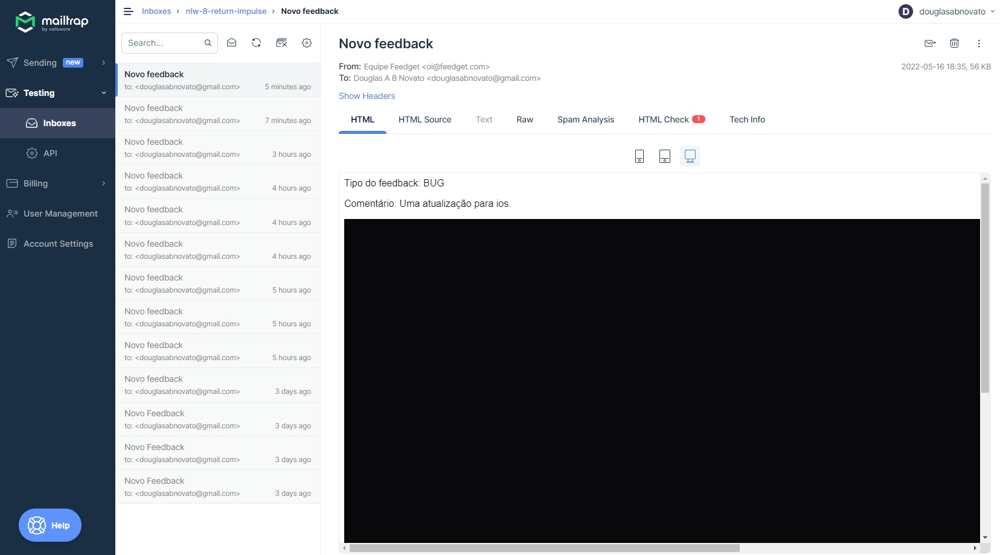
  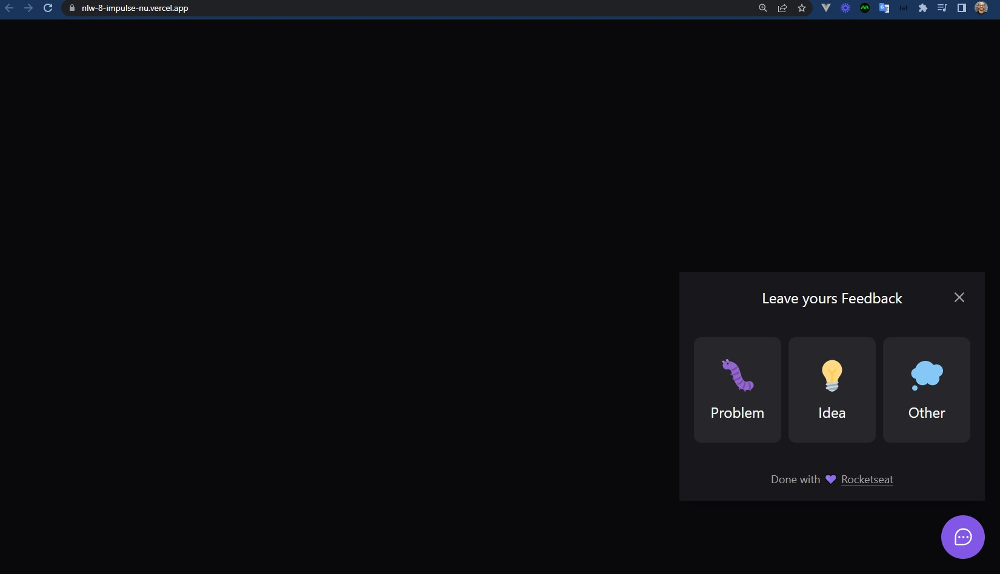
  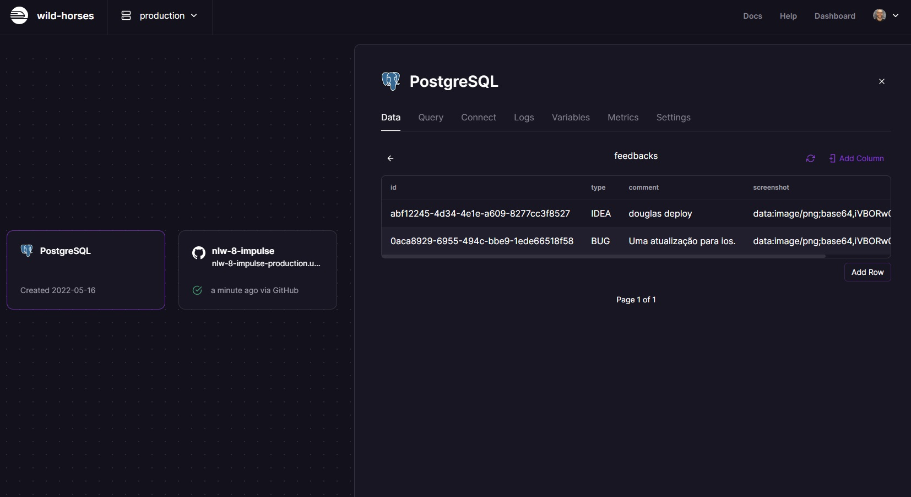
  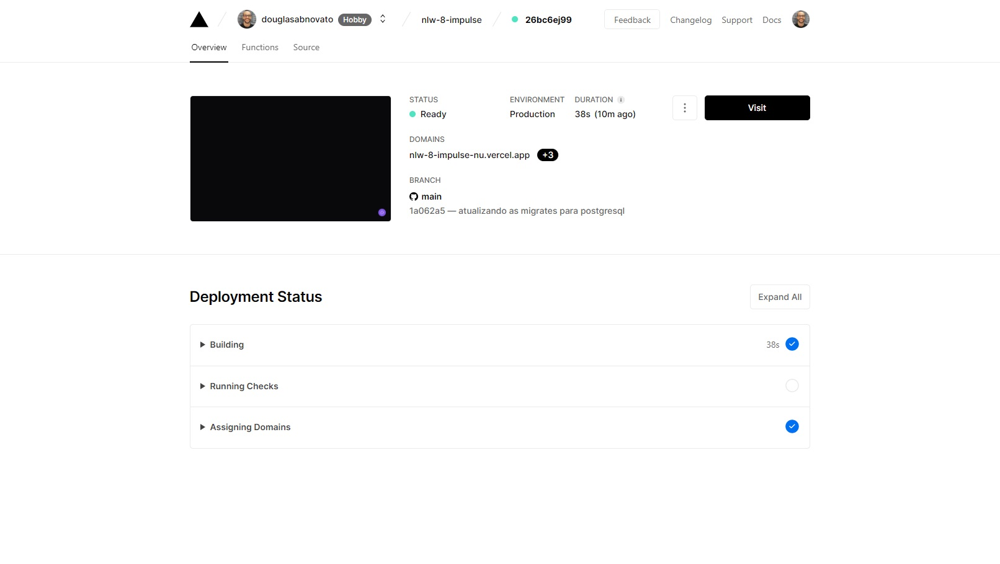
</p>

### 🛠 Construindo
 
---

#### back
- setup da aplicação
- rota
- prisma para banco de dados
- estrutura do banco de dados: tabela feedback
- enviar email com a mailtrap
- teste unitário com  jest

#### front
- Componentização
- Propriedades
- Comunicação entre os componentes no reactjs
- pixel perfect
- navegação pelo teclado
- ux

### 😯 Finalizado 

---

- Construindo a aplicação em versões.
- versão 2
<p align="center" style="display: flex; align-items: flex-start; justify-content: center;">
  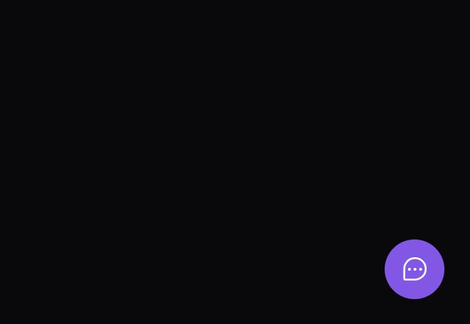
  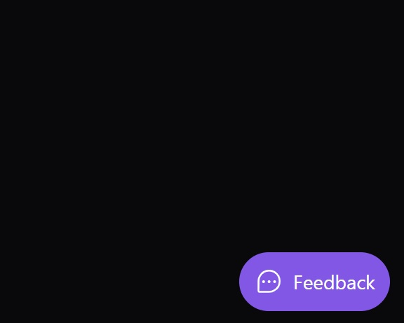
  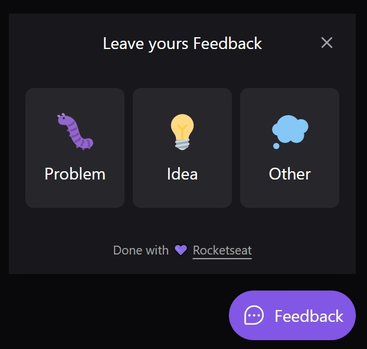
  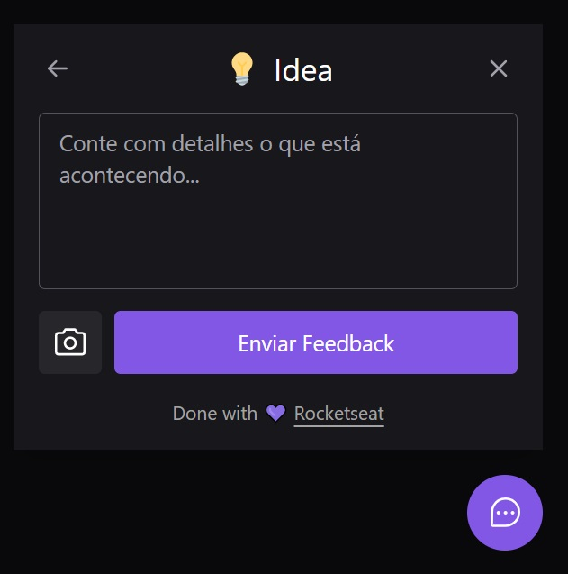
</p>
- versão 0, versão 1
<p align="center" style="display: flex; align-items: flex-start; justify-content: center;">
  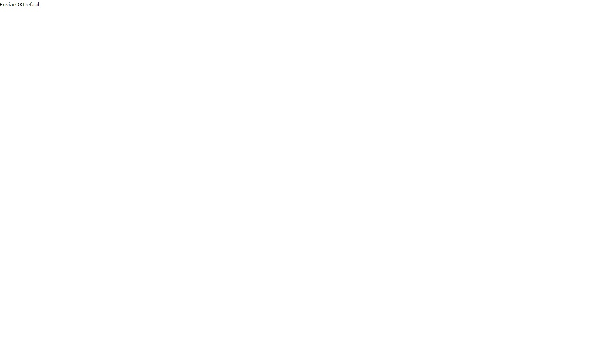
  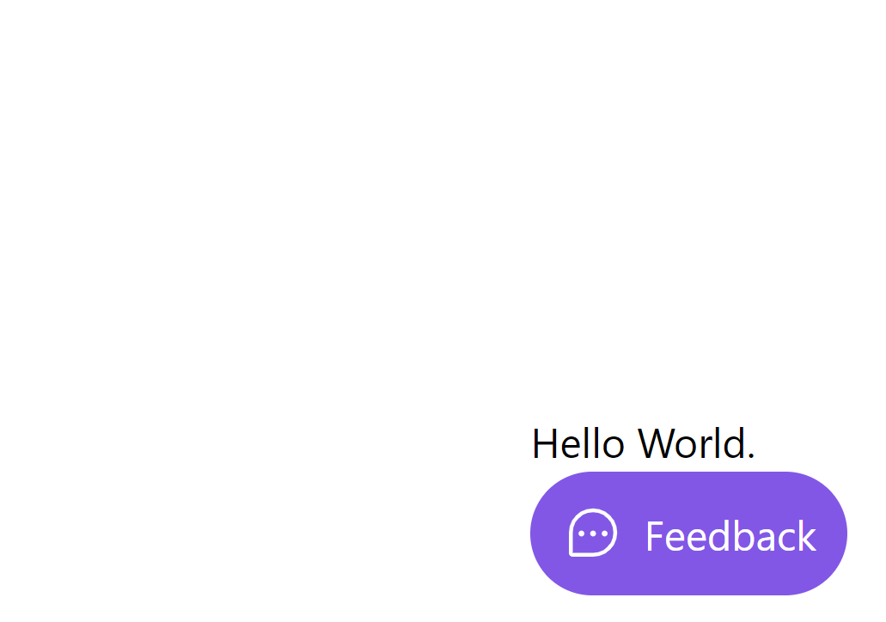
</p>

### 🧭 Adicionado

---

- texto da aplicação em inglês

### 💻 Próximo passo

- fazer o translate da aplicação: português inglês
- responsividade de forma fluída
- tema dark e light
- melhorar o html do e-mail
- dashboard dos feedbacks com autenticação usando firebase/oAuth
- validação de campos e erros

---  

Feito com ❤️ por Douglas A B Novato 👋🏽 [Entre em contato!](https://www.linkedin.com/in/douglasabnovato/)

## Próximos passos do responsável

- Ler a mensagem de erro do deploy na Vercel e conferir o Root Directory (`web`), passo a passo na #11.
- Publicar a API e a demo com o `render.yaml` (#3).
- Criar a conta do GoatCounter (#15), ligar os alertas do Dependabot (#26) e exigir o job `e2e` na `main` (#27).
