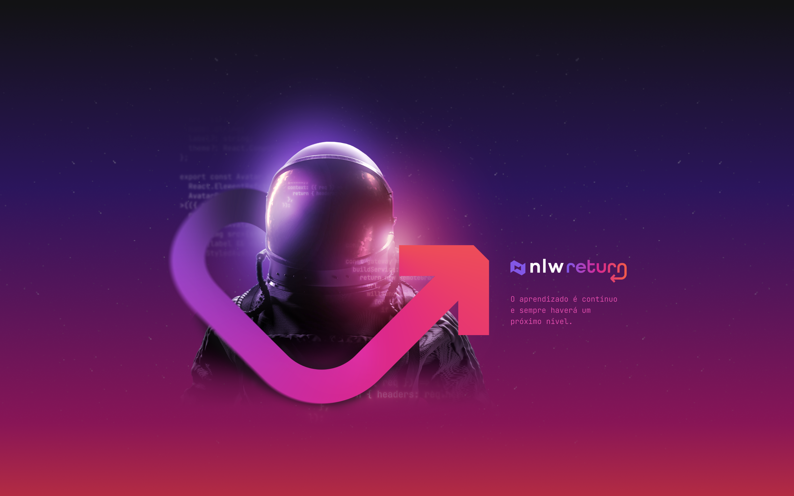

<h3 align="center"> 
	🚧 Feedback Widget 🚀
</h3> 

<h1 align="center">
    
</h1>

Desafios da trilha Impulse 💜 da NLW 8 Return da Rocketseat.

### 💻 Sobre o projeto

---

- Inspiração do projeto desenvolvido no Bootcamp NLW-8 Return na trilha Impulse da Rocketseat.

  
  
  

- Desenvolver um widget para capturar feedback.

  

- Utilizar o template do layout a seguir para construir.

  

- Seguir o paradigma mobile first para desenvolver o layout.

### 🚀 Layout

---

- Consultar e atender o layout do projeto no [Figma](https://www.figma.com/community/file/1102912516166573468). Utilizar os assets exportando do figma. 
- Mais detalhes estão no [Notion](https://efficient-sloth-d85.notion.site/NLW-Return-4e1cf60ece8f42d08254810f7bb14401)

### 🚀 Techs

---

- html, css, javascript
- reactjs
- typescript
- tailwind
- acessibilidade com headless
- pixel perfect
- navegação pelo teclado
- ux

### 🛠 Construindo
 
---

- Componente
- Propriedades
- Comunicação entre os componentes no reactjs

### 😯 Finalizado 

---

- Construindo a aplicação em versões.
- versão 2

  
  
  
  

- versão 0, versão 1

  
  

### 🧭 Adicionado

---

- texto da aplicação em inglês

### 💻 Próximo passo

- fazer o translate da aplicação: português inglês
- responsividade de forma fluída

---  

Feito com ❤️ por Douglas A B Novato 👋🏽 [Entre em contato!](https://www.linkedin.com/in/douglasabnovato/)
