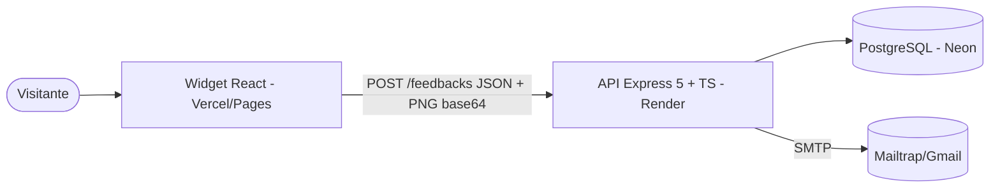
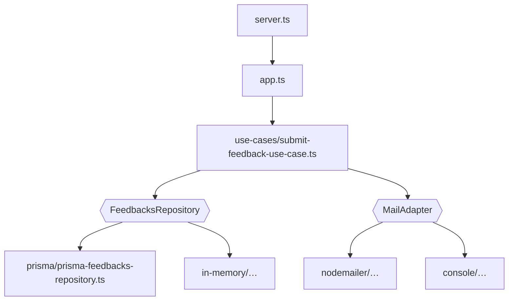

# Arquitetura — Feedget

## 1. C4

A arquitetura em camadas do projeto original foi mantida (caso de uso dependente de interfaces). O repositório Prisma agora depende de uma interface mínima (`PrismaLike`), o que permite compilar e testar sem o cliente gerado.

## 2. Modelo de dados

| Coluna | Tipo |
|---|---|
| id | UUID |
| type | `BUG` \| `IDEA` \| `OTHER` (validado na aplicação) |
| comment | até 1000 caracteres |
| screenshot | PNG base64 até 4 MB (opcional) |
| createdAt | timestamp, indexado (migration nova) |

## 3. Contrato

| Rota | Resposta |
|---|---|
| `POST /feedbacks` `{ type, comment, screenshot? }` | 201 `{ id }` · 400 `{ error, details }` · 413 · 429 |
| `GET /health` | `{ status, feedbacksLast7Days }` |

## 4. ADRs

- **ADR-001 — Credenciais SMTP por ambiente;** sem SMTP configurado o adaptador de console é usado (a API funciona sem e-mail).
- **ADR-002 — Gravar antes de notificar.** Falha no e-mail é registrada em log e não descarta o feedback.
- **ADR-003 — Limite coerente ponta a ponta:** o widget captura só a área visível (escala 1); a API aceita PNG até `MAX_SCREENSHOT_MB` e responde 413 acima disso.
- **ADR-004 — Express 5** para que erros assíncronos cheguem ao handler central.
- **ADR-005 — Prisma 6 com cliente carregado sob demanda.** Sem `DATABASE_URL`, a API usa o repositório em memória (útil para demonstração e testes).

## 5. Fora do escopo

Painel para ler os feedbacks, pacote npm/script para embutir o widget em outros sites, app mobile (React Native) da trilha.
